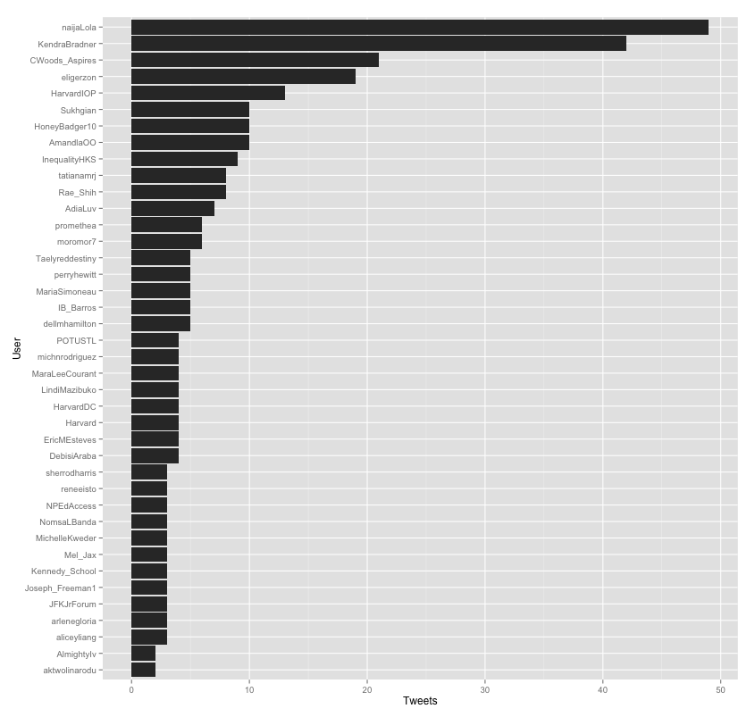
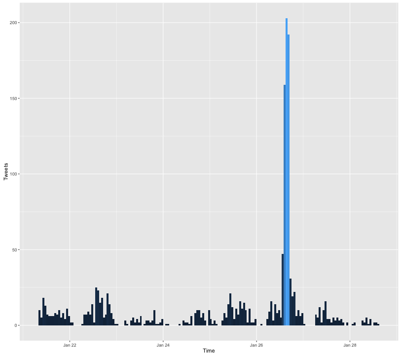
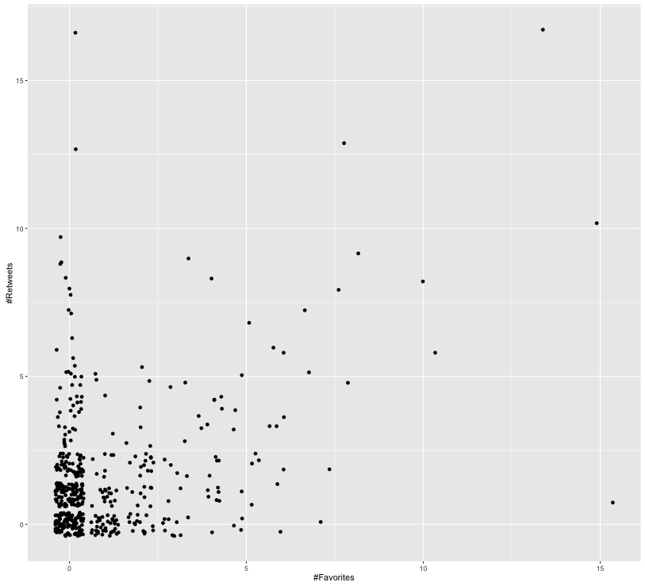

# Harvesting Tweets with R

## Voraussetzungen
* Eine [R](https://www.r-project.org)- und am besten eine [R-Studio](https://www.rstudio.com)-Installation
* Die R Bibliothek [twitteR](https://cran.r-project.org/web/packages/twitteR/index.html)
* Ein mit Telefonnummer verifizierter Twitter Account
* Eine in diesem Account erstellte Twitter-Application
* "consumer key" und "consumer secret" dieser Application

## Einschränkungen
> Before getting involved, it’s important to know that the Search API is focused on relevance and not completeness. This means that some Tweets and users may be missing from search results.  
> [Quelle: Dokumentation der Twitter REST APIs](https://dev.twitter.com/rest/public/search)

## Tweets suchen mit R
	# Bibliotheken laden
	library(twitteR)
	library(base64enc)
	library(httr)
	library(httpuv)
	
	# Twitter Application authentifizieren
	consumer_key <- 'hier den consumer key einfügen'
	consumer_secret <- 'hier das consumer secret einfügen'
	setup_twitter_oauth(consumer_key, consumer_secret, access_token=NULL, 	access_secret=NULL)
	
	# Nach Tweets suchen
	search_term <- "#someHashtag"
	tweets <- searchTwitter(search_term, n=1500)
	
## Tweets in SQLite Datenbank speichern
	# Bibliotheken laden
	library(RSQLite)
	
	# Datenbank mit twitteR registrieren
	register_sqlite_backend("/Path/to/your/tweets.sqlite")
	
	# Tweets in Datenbank speichern
	store_tweets_db(tweets, table_name="tweets")
	
	# Tweets aus Datenbank laden
	tweets <- load_tweets_db(as.data.frame = FALSE, table_name = "tweets")

## Tweets pro Nutzer Diagramm erzeugen mit ggplot2
	# Bibliotheken laden
	library(dplyr)
	library(ggplot2)
	
	# Tweets pro Nutzer extrahieren und sortieren
	tweetsDF <- twListToDF(tweets)
	tweets_per_user <- tweetsDF %>% 
	  count(screenName) %>% 
	  arrange(desc(n)) %>%
	  rename(User = screenName, Tweets = n)
	
	# Die 40 produktivsten Twitter Nutzer in absteigender Reihenfolge
	# als Balkendiagramm darstellen
	ggplot(data=tweets_per_user[rev(1:40), ], aes(x=reorder(User, Tweets), y=Tweets)) +
	 geom_bar(position="dodge", stat="identity") +
	 coord_flip() +
	 xlab("User") +
	 ylab("Tweets")

## Tweets pro Stunde Diagramm erzeugen mit ggplot2
	 ggplot(data=tweetsDF, aes(x=created)) + 
	   geom_histogram(aes(fill=..count..), binwidth=3600) + 
	   guides(fill = "none") +
	   scale_x_datetime("Time") + 
	   scale_y_continuous("Tweets")
	  

## Retweet- und Favorite-Zähler analysieren
	# Hinzufügen einer Spalte "Score".
	# Der Score wird als Summe von favoriteCount und retweetCount berechnet. 
	tweetsDF <- tweetsDF %>% mutate(score = favoriteCount + retweetCount)

	# Damit Retweets nicht mehrfach gewichtet werden, entfernen wir die Retweets.
	# Leider ist das von TwitteR erzeugte isRetweet Feld unbrauchbar (immer FALSE).
	# Wir entfernen stattdessen, als akzeptable Annäherung, alle Tweets,
	# die in text, favoriteCount und retweetCount identisch sind.
	uniqueTweets <- tweetsDF %>% distinct(text, favoriteCount, retweetCount)
	
	# Retweet- und Favorite-Zähler als Scatterplot Diagramm darstellen
	ggplot(uniqueTweets, aes(favoriteCount, retweetCount)) +
	   geom_jitter() +
	   xlab("#Favorites") +
	   ylab("#Retweets")
	

	
## Top 10 Tweets als Markdown Tabelle
	# Bibliotheken laden
	library(knitr)
 
	# 10 Tweets mit den höchsten Score Werten auswählen
	top_10_tweets <- uniqueTweets %>% 
	  select(text, score) %>% 
	  top_n(10, score) %>% 
	  arrange(desc(score))
 
	# Markdown Tabelle erzeugen
	kable(top_10_tweets, format = "markdown")
	
|Tweet                                                                                                                                            | Score|
|:------------------------------------------------------------------------------------------------------------------------------------------------|-----:|
|Vorschläge für Openness-Checkliste können hier ergänzt oder verbessert werden: https://t.co/xKopRXfT5z #inetbib16 https://t.co/KitSaJ9Npm        |    30|
|Vorschlag aus dem Schreibworkshop: Lassen sie uns alle zusammen einen Tagungsbericht zur #inetbib16 schreiben. https://t.co/RteqZkyIIY           |    25|
|Radio SRF (auch so ein totgesagtes Medium...) fasst die aktuelle Debatte um Bibliotheken schön zusammen: https://t.co/CFcjGb06jL #inetbib16      |    21|
|#inetbib16 Word! Als Bibliothekar/in Selbst nur noch #openaccess publizieren für mehr Offenheit. @felixlohmeier https://t.co/W67EeZVJiN          |    18|
|RT @felixlohmeier: Vorschläge für Openness-Checkliste können hier ergänzt oder verbessert werden: https://t.co/xKopRXfT5z #inetbib16 https:…     |    17|
|Ich verstehe nicht, warum Bibliotheksverbünde so viel Arbeit von Ex Libris &amp; OCLC übernehmen. Verzerrt Wettbewerb mit Open Source #inetbib16 |    17|
|An der Hotelbar (im Bild: Runde einiger #inetbib16 Teilnehmender) fliegt der #Ball heute Abend tief!! https://t.co/gALl2UFosl                    |    16|
|Die ersten edits in #openness checkliste bei @SlideWiki treffen ein: https://t.co/VYNLKdPLjj. Toll, das wird was! #inetbib16                     |    16|
|Sehr sehr cool: @felixlohmeier entwirft eine #OpenScience Checkliste interaktiv mit dem Publikum der #inetbib16!                                 |    16|
|Und hier der Podcast zu meinem Interview auf SRF2: https://t.co/MPZVELeWX8 #inetbib16                                                            |    14|