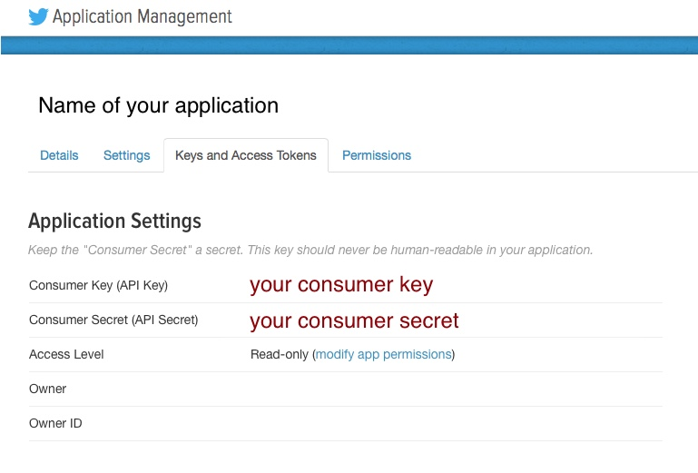
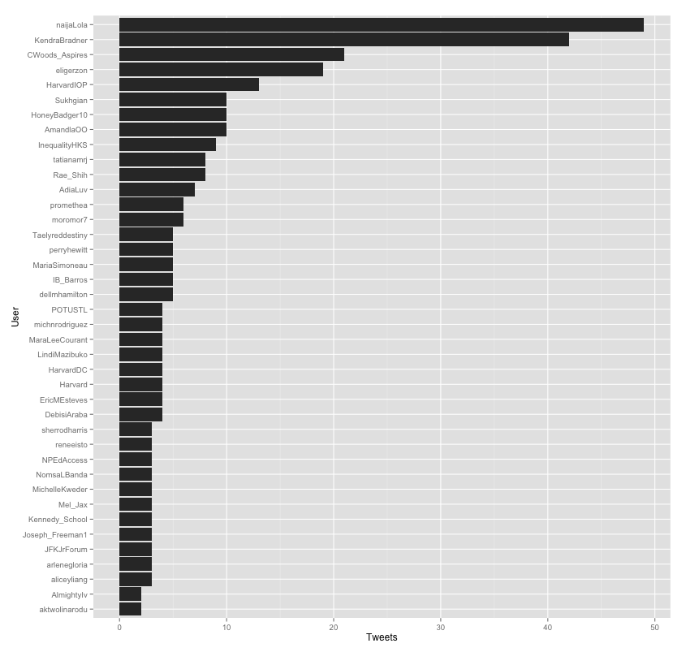
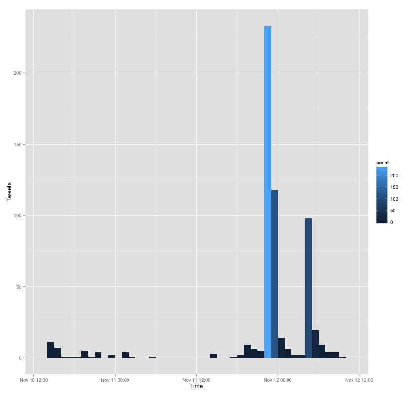

# Harvesting Tweets with R

## Voraussetzungen
* Eine [R](https://www.r-project.org)- und am besten eine [R-Studio](https://www.rstudio.com)-Installation
* Die R Bibliothek [twitteR](https://cran.r-project.org/web/packages/twitteR/index.html)
* Ein mit Telefonnummer verifizierter Twitter Account
* Eine in diesem Account erstellte Twitter-Application
* "consumer key" und "consumer secret" dieser Application

## Einschränkungen
> Before getting involved, it’s important to know that the Search API is focused on relevance and not completeness. This means that some Tweets and users may be missing from search results.  
> [Quelle: Dokumentation der Twitter REST APIs](https://dev.twitter.com/rest/public/search)

## Tweets suchen mit R
	# Bibliotheken laden
	library("twitteR")
	library("base64enc")
	library("httr")
	library("httpuv")
	
	# Twitter Application authentifizieren
	consumer_key <- 'hier den consumer key einfügen'
	consumer_secret <- 'hier das consumer secret einfügen'
	setup_twitter_oauth(consumer_key, consumer_secret, access_token=NULL, 	access_secret=NULL)
	
	# Nach Tweets suchen
	search_term <- "#someHashtag"
	tweets <- searchTwitter(search_term, n=1500)
	
## Tweets in SQLite Datenbank speichern
	# Bibliotheken laden
	library("RSQLite")
	
	# Datenbank mit twitteR registrieren
	register_sqlite_backend("/Path/to/your/tweets.sqlite")
	
	# Tweets in Datenbank speichern
	store_tweets_db(tweets, table_name="tweets")
	
	# Tweets aus Datenbank laden
	tweetsFromDatabase <- load_tweets_db(as.data.frame = FALSE, table_name = "tweets")

## Tweets pro Nutzer Diagramm erzeugen mit ggplot2
	# Bibliotheken laden
	library("ggplot2")
	
	# Tweets pro Nutzer extrahieren und sortieren
	tweetsDF <- twListToDF(tweets)
	tweets_per_user <- as.data.frame(table(tweetsDF$screenName))
	names(tweets_per_user) <- c("User","Tweets")
	tweets_per_user <- tweets_per_user[order(tweets_per_user$Tweets, decreasing=T), ]
	
	# Die 40 produktivsten Twitter Nutzer in absteigender Reihenfolge
	# als Balkendiagramm darstellen
	ggplot(data=tweets_per_user[rev(1:40), ], aes(x=reorder(User, Tweets), y=Tweets)) +
	 geom_bar(position="dodge", stat="identity") +
	 coord_flip() +
	 xlab("User") +
	 ylab("Tweets")

## Tweets pro Stunde Diagramm erzeugen mit ggplot2
	ggplot(data=tweetsDF, aes(x=created)) + 
	  geom_bar(aes(fill=..count..), binwidth=3600) + 
	  scale_x_datetime("Time") + 
	  scale_y_continuous("Tweets")
	  
	  
	 